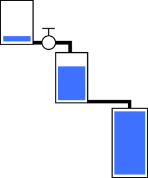

## Bounded Capacity and back-pressure

Data-flow blocks work as tanks of liquid: if the lower tank is full the higher one will start to fill.If the lower one has infinite volume the higher tanks will not be filled ever.

To configure back-pressure we have to set the capacity of every block in a chain. If some intermediate block has less flow than lower blocks it will be the bottleneck and act as the source of back-pressure (just like a valve).

### The test scenario

**Flow settings:**

We produce **10** messages per sec.

Transform block runs in **4** parallel copies and can transform **2** messages per sec (total transformation flow is 4 * 2 = **8** messages per sec)

**No bounded capacity limit:**

If we don't limit the bounded capacity all will be buffered by the last block (all "liquid" will flow to the very last tank).

We can see that transform in queue accumulates few messages. The difference in flow is 10 - 8 =2.

The in queue of the action block accumulates the most. The difference in flow is 8 - 1 = 7.

**Action block has capacity limit of 30**

The in queue of the action block fills the first. When it's full the next buffer (transform out buffer) starts to fill.

**Action block has capacity limit of 30 and transform buffer has capacity limit of 50**

The in queue of the action block fills the first. When the action block is full the out buffer of the transform block starts to fill.

When it's also full the producer is blocked on Sending new items until some space is freed in the buffers (*back pressure*).

**Capacity limit of the transform block applies to any of its buffers: in and out**

Here we have fast action block, fast producer but slow transform.

When the in-buffer is full (30) the producer is blocked.

### **Test scenario 2**

The batch block is triggered by items count and by timer (Whatever happens first)

**Flow:**

Timer is disabled.

Producer flow is **100** items / sec

Batch size is **25.**

Batch block has bounded capacity of output buffer **100** items

Action block has the flow of **1** batch / sec and bounded capacity of **1** batch

The in buffer of the action block is effectively disabled because of bounded capacity of 1 batch (it is a queue of 1 item)

The batch out-buffer fills up to **4** batches (because 4 batches of 25 items = **100** items and its bounded capacity is 100)

Then, the back-pressure starts and the producer blocks.

When we enable the timer that triggers batch each 10 ms the following happens.

Timer constantly triggers the batch block to push the incomplete batch to the output buffer.

This leads to batches of **1** item instead of **25.** However, the bounded capacity of 100 items applies. When we have 100 batches of 1 item the producer is blocked.

## The difference between Post() and SendAsync()

The official documentation states the following:

**Post()**
Posts an item to the ITargetBlock.

- if the item was accepted by the target block
  returns "true"
- otherwise 
  returns false

**SendAsync()**
Asynchronously offers a message to the target message block, allowing for postponement.
Returns a Task that represents the asynchronous send.

- If the target accepts and **consumes** the offered element during the call to SendAsync
  upon return from the call the resulting Task will be **completed** and its Result property will return "**true**".

  

- If the target **declines** the offered element during the call,
  upon return from the call the resulting Task will be **completed** and its Result property will return "**false**"

  

- If the target **postpones** the offered element,
  the element will be **buffered** until such time that the target **consumes** or **releases** it,
  at which point the task will complete, with its Result indicating whether the message was consumed.

  

- If the target **never** attempts to **consume** or **release** the message,
  the returned task will **nevercomplete**

  

### The results of our observations:

The behavior differs in the back-pressure scenario and in case of exceptions in the action / transform block.

|             | Bounded capacity reached                                     | Exception is thrown **+** back pressure                      |
| :---------- | :----------------------------------------------------------- | :----------------------------------------------------------- |
| Post()      | Returns **false** immediately.To implement back-pressure a loop with sleepis needed. | Returns **true** immediately.Next Post-s will return **false**. |
| SendAsync() | Returns a **Task** that will be **finished** whenthere is **free capacity**.If the task is awaited the back-pressureworks without loops and sleeps.Consumer async continuations are effectivelypropagated to the producer and can be awaitedin the composition root. | Returns a **failed Task.**If it's awaited the exception of the actionblock is propagated.Next SendAsync-s will return failed tasks. |

As you can see from the table above the exception handling behavior is similar:

When an exception is thrown in the action / transformation block the it goes into a **failed** state and **stops processing messages.**

**Always handle exceptions in the data-flow blocks!**